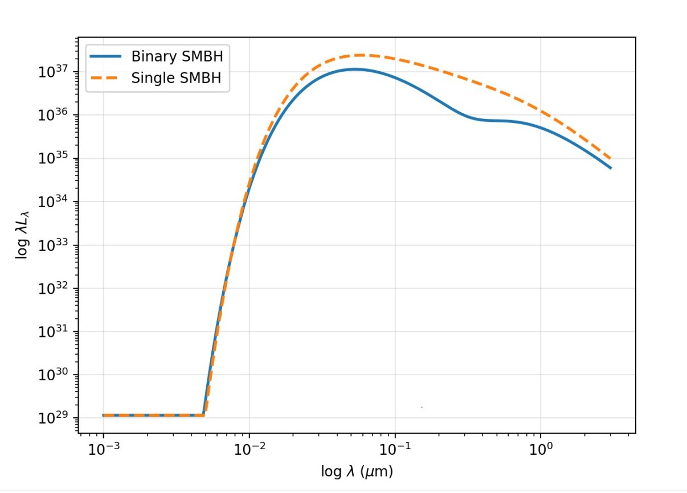

# binary-smbh-sed
Computational model of binary supermassive black hole SEDs (Spectreal Energy Distribution) , built from Planck's law through Shakura-Sunyaev disk theory. Reveals a spectral deficit signature that could help identify binary candidates observationally.

# Modeling the Spectral Energy Distributions of Binary Supermassive Black Holes
A first principles computational model showing that binary supermassive black hole (SMBH) systems produce a spectroscopically distinct signature; a spectral deficit that could help identify binary candidates observationally.

**[Read the full write-up](paper.pdf)**

# Key Result
A binary SMBH system and a single quasar of the same total mass and accretion rate produce nearly identical SEDs at short wavelengths, but diverge sharply between ~0.05–0.5 μm. This spectral deficit is caused by the central cavity that a single quasar's disk doesn't have, since nothing clears that region. 

This divergence is the core finding: it suggests broadband SED shape could serve as an observational diagnostic for binary SMBH candidates, without needing to resolve the binary directly.

# How the model is built

The model is constructed bottom-up, in three stages:

Blackbody radiation (Planck's Law) — the foundation for how any hot, optically thick surface emits light as a function of wavelength and temperature.
Single quasar accretion disk (Shakura-Sunyaev thin disk theory) — treats the disk as a series of concentric blackbody rings, each at a temperature set by radius, black hole mass, and accretion rate:

   T(r) = T₀ × (r/r_in)^(−3/4) × [1 − √(r_in/r)]^(1/4)

Integrating Planck's law over all these rings gives the full single-quasar SED.

Binary SMBH model — extends the single-disk model to three components: one outer circumbinary disk and two inner mini-disks, one around each black hole, separated by a central cavity cleared by the binary's orbital dynamics.

  

Each component is modeled as its own thin disk, and the total SED is the sum of all three, with the resulting cavity showing up directly as a dip in the combined spectrum.

  

The hot, compact mini-disks (T₀ ~ 1.8–2.2 × 10⁵ K) dominate emission at short wavelengths, while the cooler, larger circumbinary disk (T₀ ~ 1.5 × 10⁴ K) dominates at longer optical wavelengths — the gap between them is the cavity signature.
